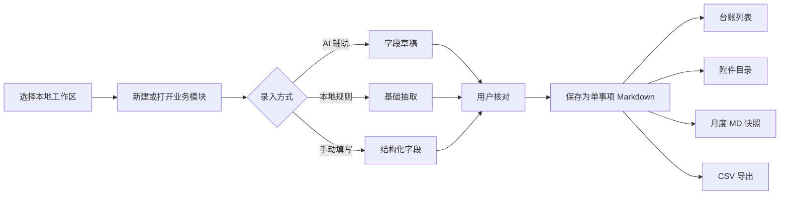
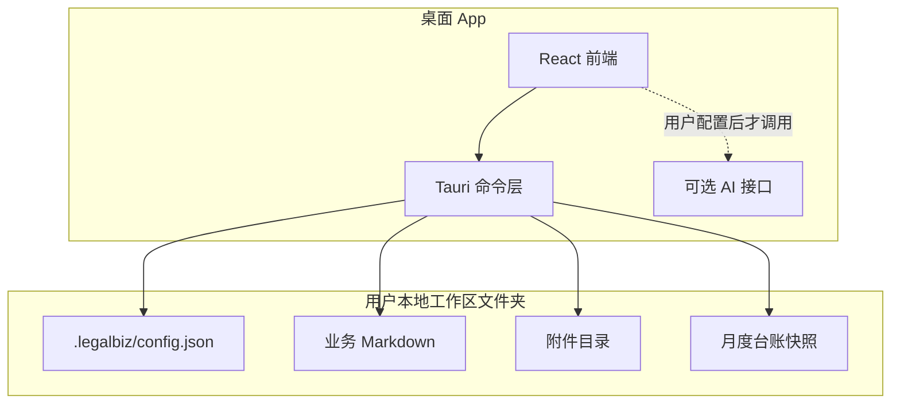
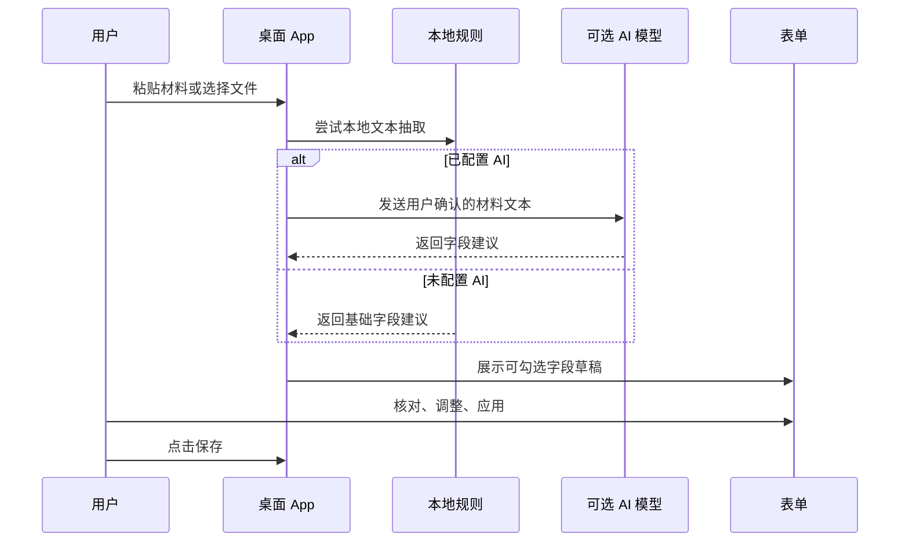
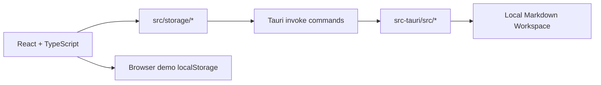
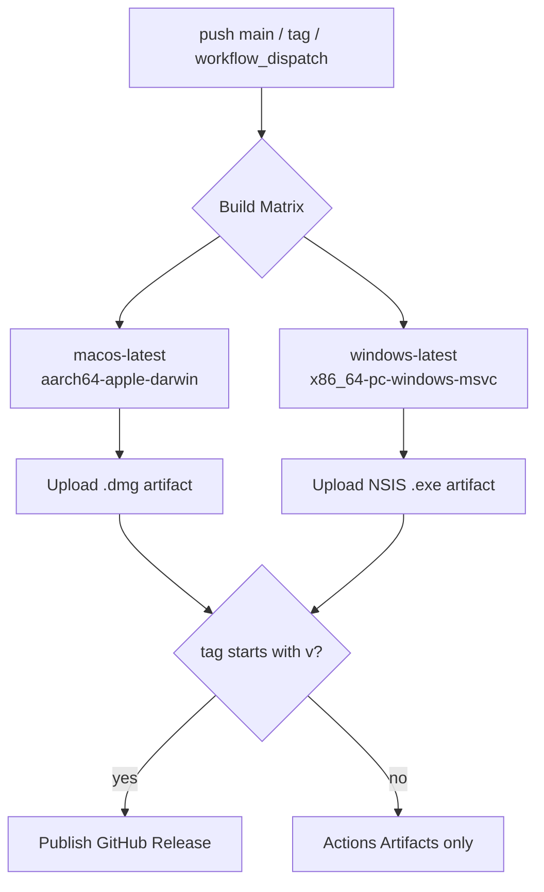

# 法律人业务管理系统


一套面向律师、法务和小型法律服务团队的本地桌面业务管理系统。它不是云端 CRM，也不要求账号、服务器或数据库部署；用户只需要选择一个本地文件夹，客户、合同、诉讼、非诉、开票、日程和利益冲突检查都会以 Markdown 文件保存在自己的电脑里。

> 核心定位：本地文件夹就是工作区，Markdown 就是事实层，AI 只做填表助手，所有写入都由用户确认。

## 目录

- [产品亮点](#产品亮点)
- [适合谁使用](#适合谁使用)
- [功能总览](#功能总览)
- [业务流程图](#业务流程图)
- [主要模块](#主要模块)
- [工作区结构](#工作区结构)
- [典型使用流程](#典型使用流程)
- [AI 填表与文件解析](#ai-填表与文件解析)
- [使用技巧](#使用技巧)
- [安装与运行](#安装与运行)
- [从源码开发](#从源码开发)
- [GitHub Actions 打包](#github-actions-打包)
- [数据与隐私边界](#数据与隐私边界)
- [路线图](#路线图)

## 产品亮点

| 能力 | 说明 |
| --- | --- |
| 完全本地化 | 不依赖服务器，不要求账号系统，业务资料保存在用户选择的本地文件夹中。 |
| Markdown 主数据 | 每条记录都是独立 Markdown，结构化字段写入 YAML frontmatter，自然语言说明写在正文。 |
| 单事项 + 月快照 | 客户、合同、案件等单条记录是事实来源，月度台账只是从事实来源生成的快照。 |
| 固定业务模块 | 客户、利冲、服务合同、诉讼、非诉、开票、日历七大模块覆盖常见法律业务。 |
| 字段级自定义 | 每个模块可以调整字段是否入台账、是否可筛选，也可以增加字段。 |
| 可直接修改记录 | 台账列表中点击“修改记录”，右侧表单进入编辑模式，保存后更新原 Markdown。 |
| 本地利冲辅助 | 基于现有客户、历史事项和相对方字段做本地匹配，帮助立项前人工核查。 |
| 智能收件箱 | 拖入文件后进入待处理 Box，可去重、AI 判断文档类型、抽取字段并建议新建或关联记录。 |
| 案件文件整理 | 诉讼案件可扫描本地案件文件夹，生成整理建议，用户勾选确认后再移动、重命名和写入整理日志。 |
| AI 辅助填表 | 可粘贴文本或上传文件，让 AI 生成字段草稿，用户确认后再应用到表单。 |
| 附件归档 | 每条记录可维护独立附件目录，便于和 Finder、Obsidian、Git 等工具配合。 |
| 跨平台安装包 | 支持 macOS `.dmg`，GitHub Actions 可构建 Windows NSIS `*.exe` 安装包。 |

## 适合谁使用

- 独立律师：希望用一个本地工具管理客户、案件、合同、开票和日程。
- 小型法律服务团队：不想先搭服务器，也不想把全部业务资料放到云端 CRM。
- 企业法务：需要把事项、合同、日程、开票、利冲记录沉淀在本地资料库。
- 重视可迁移数据的人：希望记录能被普通文本编辑器、Obsidian、Git 继续读取。

## 功能总览

```mermaid
flowchart TB
  Product((法律人业务管理系统))
  Product --> Workspace[工作区]
  Product --> Modules[台账模块]
  Product --> Data[数据能力]
  Product --> Assistant[智能辅助]
  Product --> Delivery[交付]

  Workspace --> WorkspaceA[新建本地工作区]
  Workspace --> WorkspaceB[打开最近工作区]
  Workspace --> WorkspaceC[重读 Markdown]
  Workspace --> WorkspaceD[多工作区切换]

  Modules --> ModulesA[客户管理]
  Modules --> ModulesB[利冲检查]
  Modules --> ModulesC[服务合同]
  Modules --> ModulesD[诉讼管理]
  Modules --> ModulesE[非诉管理]
  Modules --> ModulesF[开票管理]
  Modules --> ModulesG[日历管理]

  Data --> DataA[单事项 Markdown]
  Data --> DataB[YAML frontmatter]
  Data --> DataC[月度台账快照]
  Data --> DataD[CSV 导出]
  Data --> DataE[附件目录]
  Data --> DataF[收件箱待处理区]

  Assistant --> AssistantA[AI 字段抽取]
  Assistant --> AssistantB[本地规则抽取]
  Assistant --> AssistantC[关系字段复用]
  Assistant --> AssistantD[本地利冲分析]
  Assistant --> AssistantE[新建/关联建议]

  Delivery --> DeliveryA[macOS DMG]
  Delivery --> DeliveryB[Windows EXE]
  Delivery --> DeliveryC[GitHub Actions]
```



## 业务流程图

### 从材料到台账



### 本地数据边界



## 主要模块

| 模块 | 解决的问题 | 典型字段 |
| --- | --- | --- |
| 客户管理 | 管理客户基本信息、联系人、关联方、历史相对方。 | 客户名称、客户类型、联系人、关联方、历史相对方、负责人、状态 |
| 利冲检查 | 在接案或签约前记录利益冲突核查过程。 | 检查主题、拟委托人、相对方、关联方、检查日期、人工结论 |
| 服务合同 | 管理委托合同、法律服务合同和收款状态。 | 合同名称、客户、合同编号、服务范围、签署日期、金额、开票状态 |
| 诉讼管理 | 管理案件信息、法院、案号、开庭、期限、下一步任务和本地案件材料整理。 | 案件名称、客户/委托人、当事人、案号、法院、案由、程序、关键期限 |
| 非诉管理 | 管理合同审查、咨询、专项服务等非诉事项。 | 业务名称、客户、业务类型、交付期限、审查轮次、页数、字数、状态 |
| 开票管理 | 管理应收、已收、发票号、开票日期和合同关联。 | 开票事项、客户、关联服务合同、应收金额、已收金额、开票状态 |
| 日历管理 | 管理开庭、会议、期限、交付、任务等日程。 | 日程标题、类型、日期、时间、关联事项、状态 |

## 工作区结构

系统不会把数据锁在私有数据库里。一个标准工作区大致如下：

```text
法律业务工作区/
  .legalbiz/
    config.json
  clients/
    CLI-2026-0001/
      index.md
      attachments/
  contracts/
    CON-2026-0001/
      index.md
      attachments/
  matters/
    2026/
      LIT-2026-0001/
        index.md
        notes/
        attachments/
        events/
      NON-2026-0001/
        index.md
        notes/
        attachments/
        events/
  conflict-checks/
    2026/
      CHK-2026-0001.md
      CHK-2026-0001-attachments/
  invoices/
    2026/
      INV-2026-0001.md
      INV-2026-0001-attachments/
  calendar/
    2026/
      CAL-2026-0001.md
      CAL-2026-0001-attachments/
  ledgers/
    2026/
      2026-05-litigation.md
```

单条 Markdown 记录示例：

```markdown
---
id: LIT-2026-0001
module: litigation
title: 岚山科技 v. 北辰贸易 服务合同纠纷
client_name: 上海岚山科技有限公司
opposing_parties: 北辰贸易有限公司
case_number: (2026)沪0105民初1234号
court: 上海市长宁区人民法院
cause_of_action: 服务合同纠纷
opened_at: 2026-03-15
limitation_deadline: 2026-05-20
status: 待开庭
---

需要在开庭前完成证据目录、代理意见初稿。
```

## 典型使用流程

### 1. 第一次打开

1. 打开桌面 App。
2. 点击侧边栏的“浏览”按钮，选择一个本地文件夹。
3. 如果该文件夹还不是工作区，点击“新建”。
4. 如果已经是工作区，点击“打开”。
5. 后续可直接从“最近工作区”进入。

### 2. 新建记录

1. 进入对应业务模块，例如“客户管理”或“诉讼管理”。
2. 填写结构化字段。
3. 在“Markdown 正文”里补充背景、沟通纪要、办理思路或复盘。
4. 点击“保存为单事项 MD”。

### 3. 修改记录

1. 在台账列表中找到目标记录。
2. 点击右侧铅笔按钮“修改记录”。
3. 右侧表单会进入“修改”模式并载入原字段和正文。
4. 修改后点击“保存修改”。
5. 系统会更新原 Markdown 文件，不会新增重复记录。

### 4. 生成月度台账

1. 在任一模块选择月份。
2. 使用关键词或字段筛选当前列表。
3. 点击“生成月度 MD 快照”。
4. 快照会写入 `ledgers/{year}/{yyyy-mm}-{module}.md`。

### 5. 导出 CSV

1. 在台账列表中筛选出需要的记录。
2. 点击“导出 CSV”。
3. 导出的 CSV 带 UTF-8 BOM，Excel 可以直接打开。

## AI 填表与文件解析

每个新建或修改表单都可以配合“AI 助手 · 解析后填充表单”使用。



支持场景：

- 粘贴合同、邮件、沟通纪要、案件摘要等文本。
- 上传有文字层的 PDF、DOCX、TXT、MD、CSV、JSON、YAML 等文件。
- 对非诉事项上传 `.docx`，自动读取页数和字数。
- 未配置 AI 时，仍可使用本地规则做基础提取。

注意边界：

- 扫描件 PDF 和图片 PDF 目前不做本地 OCR，需要先 OCR 后再粘贴或上传。
- 旧版 `.doc` 不可靠，建议另存为 `.docx`。
- AI 返回的是草稿，不会直接写入 Markdown；用户必须确认后保存。

### 智能收件箱

左侧“收件箱”是批量处理入口，适合把新收到的材料先丢进一个 Box，再逐条确认：

1. 拖入文件，或点击选择文件。
2. 系统先按文件 hash 去重，避免同一文件生成多条待处理记录。
3. 点击“AI 分析”，由模型判断材料类型、目标模块，并抽取字段草稿。
4. 如果匹配到现有事项，可以选择“关联记录”；没有匹配时选择“创建记录”。
5. 确认后文件会进入对应记录附件目录，收件箱条目移入 processed 记录。

### 诉讼案件文件整理

诉讼台账的每条记录右侧有“案件文件整理”按钮。它适合处理已经放进某个案件主文件夹里的材料：

1. 点击“扫描案件目录”，系统会比对上次扫描结果，找出新增或变更文件。
2. 勾选需要整理的文件，可选择“初筛生成方案”或“深入分析后生成方案”。
3. 系统会建议目标目录、规范文件名、待办、期限和整理摘要。
4. 所有移动、重命名、写入 Markdown 的动作都会列成待确认操作。
5. 只有点击“执行已确认操作”后，才会真正改动本地文件夹。

## 使用技巧

### 多工作区

可以按年份、团队、客户组或业务类型创建多个工作区，例如：

```text
LegalBiz-2026/
LegalBiz-企业客户/
LegalBiz-个人客户/
LegalBiz-团队共享/
```

### 字段设置

在“设置”里可以调整各模块字段：

- 是否进入台账。
- 是否作为筛选字段。
- 是否新增自定义字段。

建议把“真正需要横向比较”的字段放入台账，例如状态、负责人、日期、金额；把较长的说明放进 Markdown 正文。

### 关系字段

客户、合同、事项字段支持从已有记录中复用信息。常见用法：

- 开票记录选择服务合同后，自动带出客户、金额和合同标题。
- 诉讼或非诉事项选择客户后，利冲区域会基于历史客户、相对方和关联方提示风险。
- 台账中的关联字段可跳转到对应记录。

### 外部编辑

因为数据是 Markdown，你可以：

- 用 Obsidian 查看和补充正文。
- 用 VS Code 批量搜索。
- 用 Git 做版本管理。
- 用系统 Finder 管理附件。

外部改动后，回到 App 点击“重读 MD”即可刷新。

## 安装与运行

### 下载发行版

到 GitHub Releases 下载对应安装包：

- macOS Apple Silicon：下载 `.dmg`，打开后拖入“应用程序”。
- Windows x64：下载 `*-setup.exe`，双击安装。

macOS 首次打开如提示“未识别开发者”，可在“系统设置 -> 隐私与安全性”里允许打开。当前本地测试包未做 Apple notarization。

### 本地试用

```bash
npm install
npm run tauri:dev
```

### 浏览器演示

```bash
npm install
npm run dev
```

浏览器模式会使用演示数据和 localStorage，不会访问真实本地文件系统；完整文件夹、附件和安装包能力请使用 Tauri 桌面 App。

## 从源码开发

### 环境要求

- Node.js 24
- Rust stable
- macOS 打包需要 Xcode Command Line Tools
- Windows 打包建议使用 GitHub Actions 的 `windows-latest`

### 常用命令

```bash
npm ci
npm run lint
npm run build
cd src-tauri && cargo check
cd ..
npm run tauri:build
```

### 技术结构



主要目录：

| 路径 | 说明 |
| --- | --- |
| `src/components/` | 页面组件、表单、台账、附件抽屉、设置页。 |
| `src/storage/` | 前端数据访问层，统一封装 Tauri 和浏览器演示模式。 |
| `src/domain.ts` | 模块、字段、记录和 AI 配置类型。 |
| `src-tauri/src/` | Rust/Tauri 命令、工作区读写、配置迁移。 |
| `src-tauri/icons/` | 应用图标，macOS 打包需要 `icon.icns`。 |
| `.github/workflows/build.yml` | macOS DMG 和 Windows EXE 自动打包流程。 |

## GitHub Actions 打包

当前 workflow 支持两种入口：

- 推送到 `main`：自动构建并上传 workflow artifacts。
- 推送 `v*` 标签：构建后创建或更新 GitHub Release，并上传安装包。
- 手动运行 `Build Installers`：可在 Actions 页面点击 `Run workflow`。



Windows 只构建 NSIS `*.exe`，不再构建 MSI；这样可以避开 WiX/MSI 乱码或 `light.exe` 失败问题。macOS 打包包含真实 `src-tauri/icons/icon.icns`，用于避免 `No matching IconType`。

## 数据与隐私边界

| 数据 | 默认位置 | 是否离开本机 |
| --- | --- | --- |
| 业务记录 | 用户选择的工作区 Markdown | 否 |
| 附件 | 每条记录对应附件目录 | 否 |
| 最近工作区 | App 配置目录 / localStorage | 否 |
| AI API Key | 本机配置 | 仅调用用户配置的 AI 服务时使用 |
| AI 输入材料 | 用户主动提交的文本 | 仅配置并调用 AI 时发送 |

本项目的默认设计是 local-first。是否使用 AI、使用哪个模型、发送哪些文本，均由用户配置和操作决定。

## 路线图

- 案件文件整理增强：批量预览、OCR 接入和更细的跨案件错放提示。
- 收件箱流程增强：更细的人工确认面板、批量处理和 OCR 接入。
- 更细的重复记录检测和合并提示。
- 更多文档格式解析和 OCR 接入。
- 可选的 SQLite 索引缓存，支持更快搜索，但 Markdown 仍是事实来源。
- Windows 安装包签名和 macOS notarization。

## 许可

当前仓库用于个人和团队内部法律业务管理工具开发。正式开源许可如需发布，请在仓库中补充 `LICENSE` 文件。
